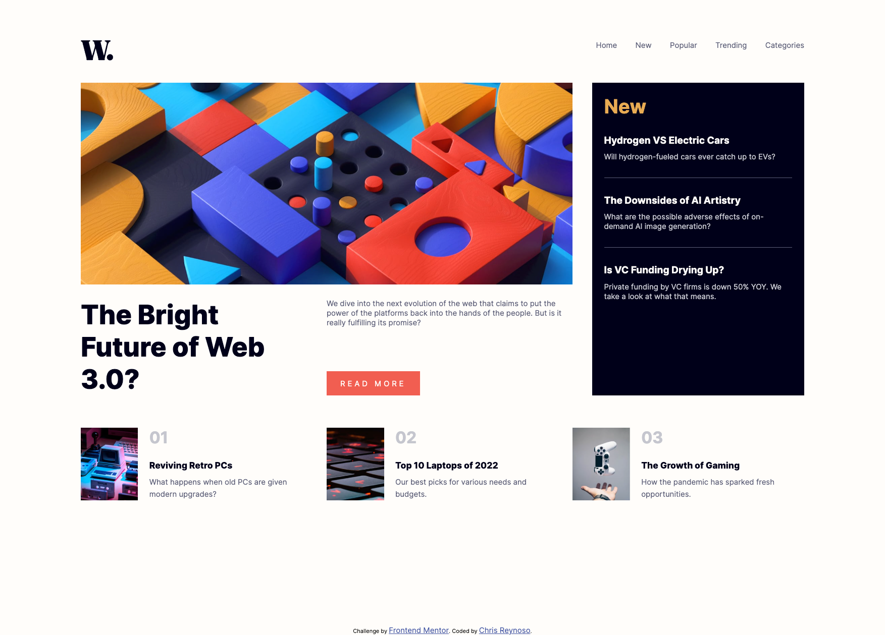
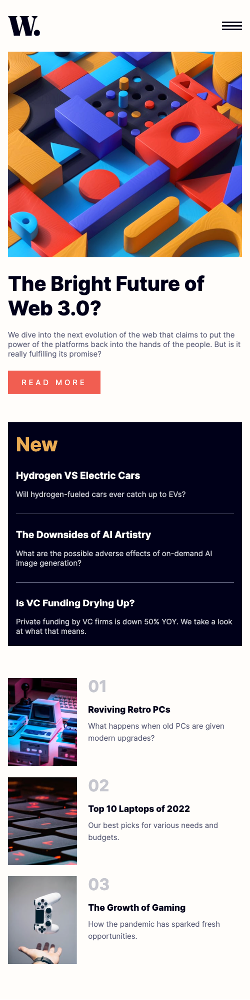

# Frontend Mentor - News homepage Challenge

## Table of contents

- [Frontend Mentor - News homepage Challenge]
  - [Table of contents](#table-of-contents)
  - [Overview](#overview)
    - [The challenge](#the-challenge)
    - [Screenshot](#screenshot)
    - [Links](#links)
  - [My process](#my-process)
    - [Built with](#built-with)
    - [What I learned](#what-i-learned)
  - [Author](#author)

## Overview

Build the Frontend Mentor News Homepage for mobile and desktop. Match it as close as possible to the design images & docs.
Add hover effects and pop out mobile navbar
### The challenge

Users should be able to:

- View the optimal layout for the interface depending on their device's screen size
- See hover and focus states for all interactive elements on the page

### Screenshot

### Links

- Solution URL: [Github]([https://your-solution-url.com)](https://github.com/chrtravels/news-homepage-layout-project)
- Live Site URL: [Github Page](https://your-live-site-url.com)

## My process

On this challenge I started out with the desktop view and then adjusted for mobile. I am still working out what would be
the best overall approach.

Building the basic HTML structure, from top to bottom and then applying styling the same way, seems to be a good approach.
Then add your JavaScript functionality.
### Built with

- Semantic HTML5 markup
- Flexbox
- JavaScript

### What I learned

That preset mobile breakpoints used in the industry are more of a guideline. If only going with a few,
the site may not look as desired across all device sizes. In some cases you may need to be more granular
with your media queries.

Thinking ahead, before coding, can save you some time.

## Author

- Frontend Mentor - [@ychrtravels](https://www.frontendmentor.io/profile/chrtravels)

## Acknowledgments
